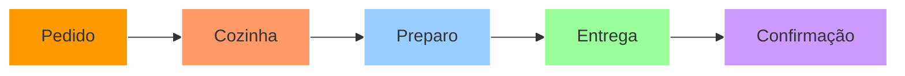
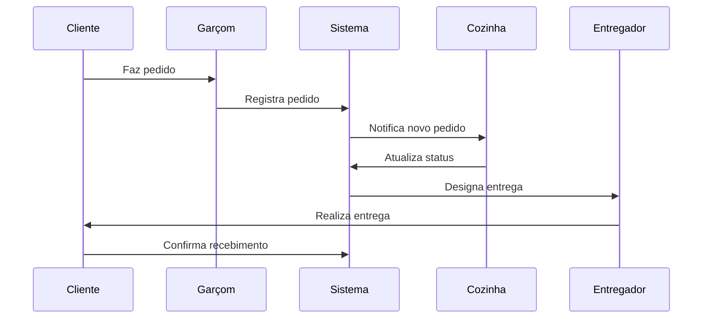

<div align="center">

```
██████╗ ███████╗██╗     ██╗████████╗██████╗  █████╗  ██████╗██╗  ██╗
██╔══██╗██╔════╝██║     ██║╚══██╔══╝██╔══██╗██╔══██╗██╔════╝██║ ██╔╝
██║  ██║█████╗  ██║     ██║   ██║   ██████╔╝███████║██║     █████╔╝ 
██║  ██║██╔══╝  ██║     ██║   ██║   ██╔══██╗██╔══██║██║     ██╔═██╗ 
██████╔╝███████╗███████╗██║   ██║   ██║  ██║██║  ██║╚██████╗██║  ██╗
╚═════╝ ╚══════╝╚══════╝╚═╝   ╚═╝   ╚═╝  ╚═╝╚═╝  ╚═╝ ╚═════╝╚═╝  ╚═╝
```

<h3>🍽️ Sistema Inteligente de Gerenciamento para Restaurantes</h3>

[](https://github.com/KerubinDev/DeliTrack)
[](https://www.python.org/)
[](https://flask.palletsprojects.com/)
[](LICENSE)

[📋 Sobre](#-sobre) • 
[🚀 Instalação](#-instalação) • 
[💡 Recursos](#-recursos) • 
[🛠️ Tecnologias](#️-tecnologias) • 
[📱 Demo](#-demo)

</div>

## 📋 Sobre

<div align="center">



DeliTrack é uma solução completa para restaurantes gerenciarem seus pedidos e entregas de forma eficiente e intuitiva. Do pedido à entrega, cada etapa é cuidadosamente monitorada para garantir a melhor experiência.

</div>

## 💡 Recursos por Perfil

<table align="center">
  <tr>
    <td align="center" width="25%">
      
      <br/><strong>👔 Gerente</strong>
      <br/>
      <sub>• Dashboard em tempo real<br/>• Gestão de usuários<br/>• Relatórios avançados</sub>
    </td>
    <td align="center" width="25%">
      
      <br/><strong>🍽️ Garçom</strong>
      <br/>
      <sub>• Registro de pedidos<br/>• Acompanhamento<br/>• Interface intuitiva</sub>
    </td>
    <td align="center" width="25%">
      
      <br/><strong>👨‍🍳 Cozinha</strong>
      <br/>
      <sub>• Fila de pedidos<br/>• Gestão de preparo<br/>• Priorização</sub>
    </td>
    <td align="center" width="25%">
      
      <br/><strong>🛵 Entregador</strong>
      <br/>
      <sub>• Rotas otimizadas<br/>• GPS integrado<br/>• Confirmações</sub>
    </td>
  </tr>
</table>

## 🚀 Início Rápido

<details>
<summary>📦 Requisitos</summary>

- Python 3.12+
- Pip (Gerenciador de pacotes)
- SQLite
</details>

<details>
<summary>⚡ Instalação</summary>

```bash
# Clone o repositório
git clone https://github.com/KerubinDev/delitrack.git

# Instale as dependências
pip install -r requirements.txt

# Execute o sistema
python iniciar.py

# Acesse em
http://localhost:5000
```
</details>

## 🔐 Acessos do Sistema

<div align="center">

| Perfil | Credenciais | Área de Atuação |
|--------|-------------|-----------------|
| 👔 **Gerente** | admin@delitrack.com<br>admin123 | Gestão completa |
| 🍽️ **Garçom** | garcom@delitrack.com<br>admin123 | Atendimento |
| 👨‍🍳 **Cozinha** | cozinha@delitrack.com<br>admin123 | Preparação |
| 🛵 **Entrega** | entrega@delitrack.com<br>admin123 | Delivery |

</div>

## 🛠️ Stack Tecnológica

<div align="center">

| Back-end | Front-end | Database | APIs |
|----------|-----------|----------|------|
|  |  |  |  |
|  |  |  |  |

</div>

## 📂 Estrutura

```plaintext
🍽️ DeliTrack/
├── 🎯 backend/
│   ├── 📊 models/
│   ├── 🛣️ routes/
│   └── ⚙️ utils/
├── 🎨 frontend/
│   ├── 📱 templates/
│   └── 🎭 static/
├── 🗺️ maps/
└── 📦 uploads/
```

## 🔄 Fluxo de Trabalho



## 👨‍💻 Autor

<div align="center">
  
  <h3>Kelvin Moraes</h3>
  <p>Full Stack Developer | Restaurant Tech Specialist</p>
  
[](https://github.com/KerubinDev)
[](mailto:kelvin.moraes117@gmail.com)

</div>

## 📄 Licença

Este projeto está licenciado sob a [GNU GPL v3](LICENSE) - veja o arquivo LICENSE para detalhes.

---

<div align="center">
  
  **[⬆ Voltar ao topo](#delitrack---sistema-de-gerenciamento-de-pedidos-e-entregas)**
  
  <sub>Desenvolvido com 🍳 por Kelvin Moraes</sub>
  
[](https://github.com/KerubinDev/DeliTrack)
</div>
